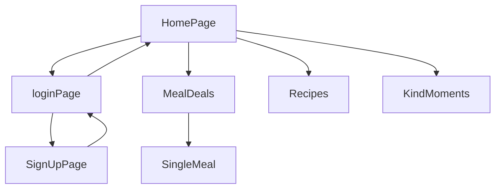

# Saasa meal

> Saasa meal is a meat-free lifestyle platform, indulging you with delicious discounted vegetarian meals at cozy environments. We are working on this website.

## Teck Stacks

- NodeJS
- React
- Chakra UI
- Redux
- React-router-dom
- React-redux
- Redux-thunk
- Vercel

## Backend Repo

## Flow

## Screen shots

## 🔗 Collaborators Profile Links

| Collaborators | Github                                                                                                                                   | Linkedin                                                                                                                                                            | Portfolio                                                                                                                                    |
| ------------- | ---------------------------------------------------------------------------------------------------------------------------------------- | ------------------------------------------------------------------------------------------------------------------------------------------------------------------- | -------------------------------------------------------------------------------------------------------------------------------------------- |
| Sandip Maurya |  |  |  |

## Deployed Link

